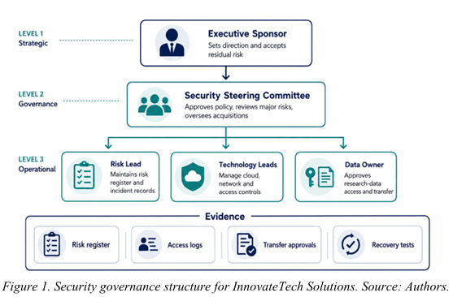
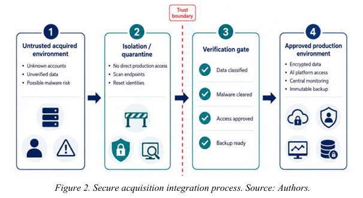
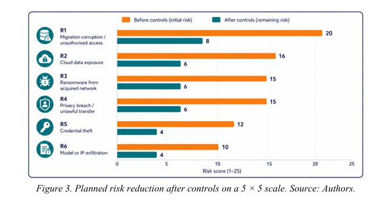
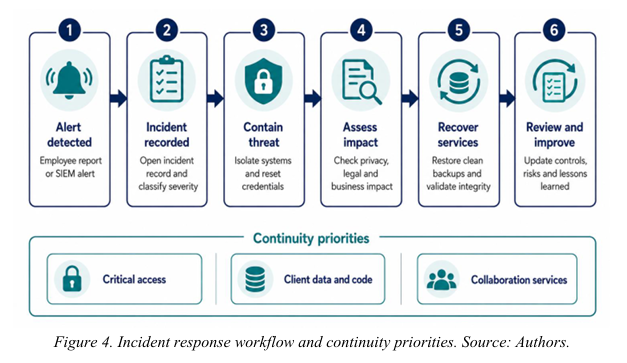
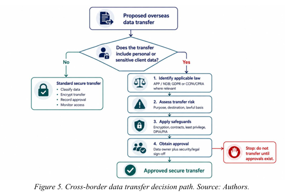

# Security-Management-Plan-Risk-Assessment
Security Management Plan and Risk Assessment for InnovateTech Solutions.

## Overview

This project presents a comprehensive Security Management Plan for InnovateTech Solutions, an Australian AI and analytics company expanding through international acquisitions.

The project evaluates cybersecurity risks associated with cross-border operations, cloud environments, data migration, and regulatory compliance while proposing appropriate security controls and risk treatments.

## Objectives

* Identify security threats and vulnerabilities.
* Perform risk assessment and risk treatment analysis.
* Develop business continuity and incident response strategies.
* Evaluate legal and regulatory compliance requirements.
* Recommend security controls and governance measures.

## Frameworks and Standards

* ISO/IEC 27001:2022
* NIST Cybersecurity Framework (CSF) 2.0
* Australian Privacy Principles (APP)
* GDPR
* CCPA/CPRA

## Key Topics

* Information Security Management Systems (ISMS)
* Risk Assessment and Risk Treatment
* Security Governance
* Business Continuity Planning
* Incident Response
* Access Control and Identity Management
* Cross-Border Data Privacy Compliance

## My Contribution

My contribution focused on:

* Cross-border privacy compliance analysis.
* Australian Privacy Principles (APP) requirements.
* GDPR and international data protection considerations.
* Legal and regulatory compliance recommendations.

## Skills Demonstrated

* Risk Management
* Security Governance
* Privacy Compliance
* Security Policy Development
* Business Continuity Planning
* Regulatory Analysis

## Academic Project

Master of Cybersecurity
Victorian Institute of Technology (VIT)

## Project Figures

### Figure 1: Security Governance Structure

### Figure 2: Secure Acquisition Integration Process

### Figure 3: Risk Reduction Matrix

### Figure 4: Incident Response Workflow

### Figure 5: Cross-Border Data Transfer Decision Path

